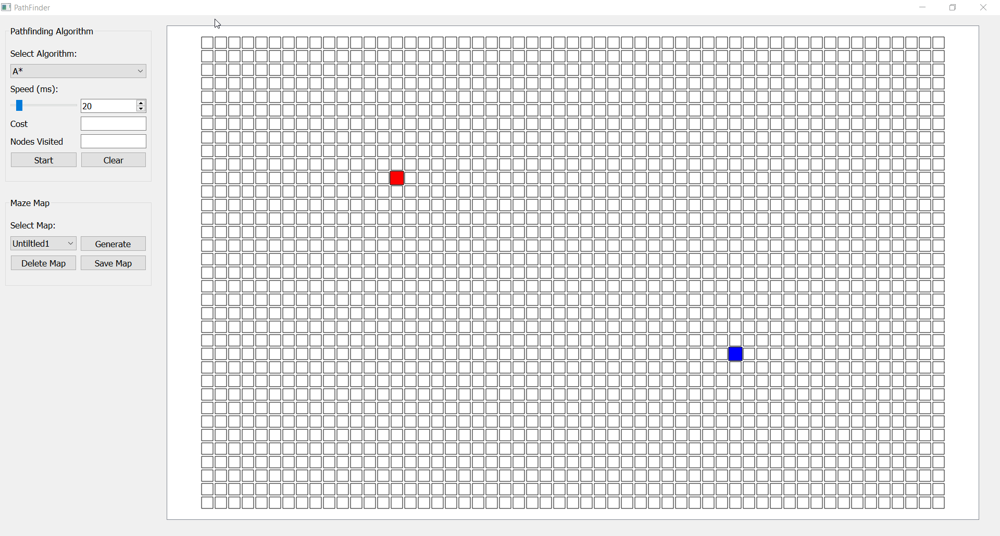
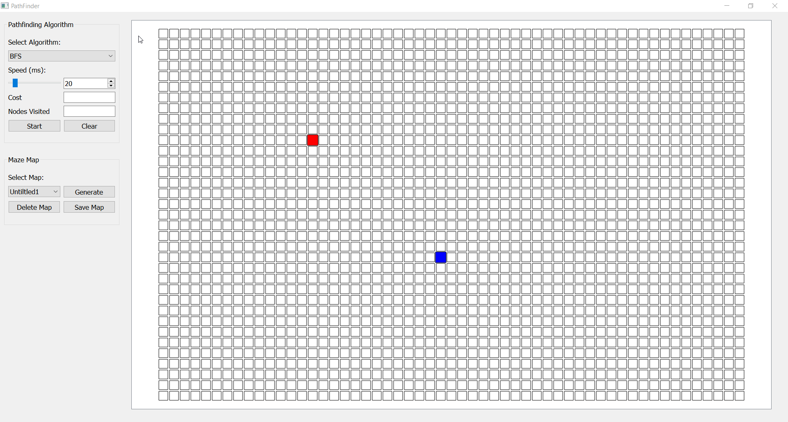
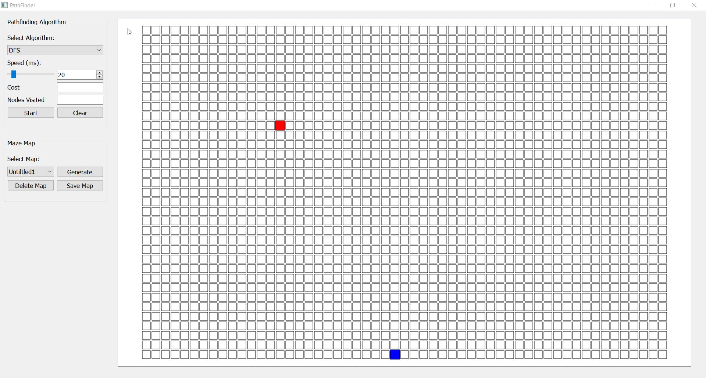
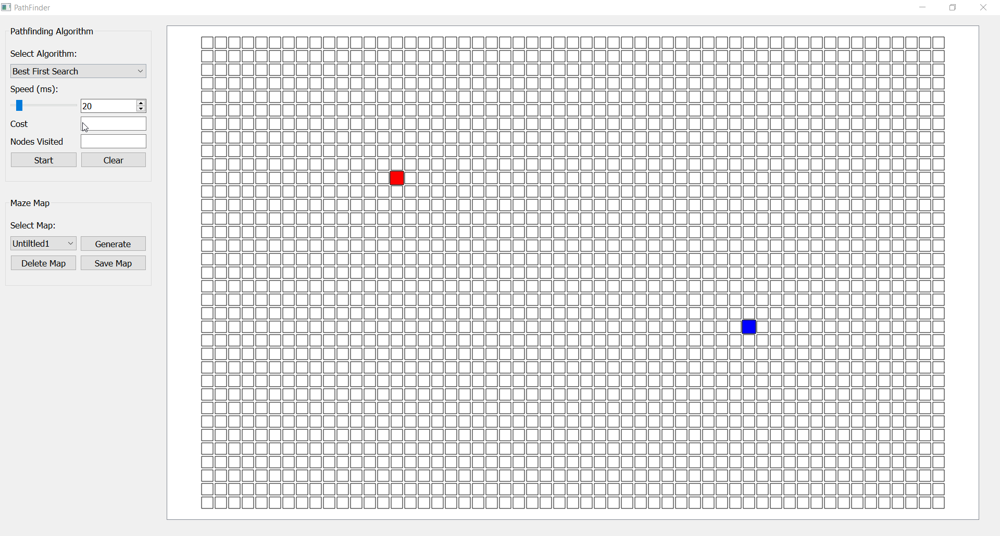
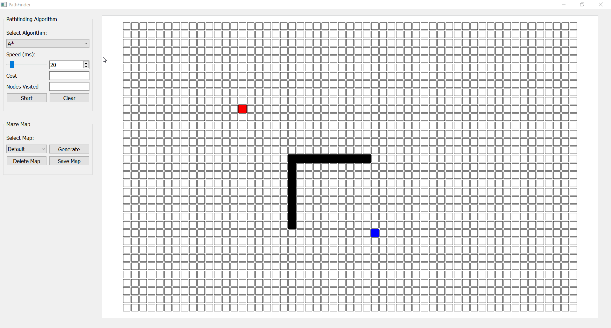
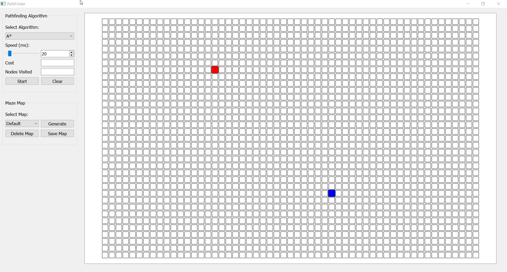

# Pathfinder
Visualizing Pathfinding Algorithms such as A*, Dijkstra, BFS, DFS, Best First Search on Application made using Qt Creator

<h2> Astar Algorithm </h2>

<h2> Dijkstra Algorithm </h2>

<h2> Breadth First Search Algorithm </h2>

<h2> Depth First Search Algorithm </h2>

<h2> Best First Search Algorithm </h2>

<h2> Obstacle Between Path </h2>

<h2> Creating and Generating Maze Map </h2>

